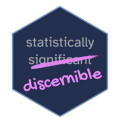

<!-- README.md is generated from README.Rmd. Please edit that file -->

```{r, include = FALSE}
knitr::opts_chunk$set(
  collapse = TRUE,
  comment = "#>",
  fig.path = "man/figures/README-",
  out.width = "100%"
)
```

# discernible 

<!-- badges: start -->
<!-- badges: end -->

The goal of discernible is to promote the use of "discernible" over "significant" after "statistically", and leave "significant" to be "practically significant".
This package is developed in a somewhat tongue-in-cheek manner, to implement ideas from Jeff Witmer's [editorial](https://doi.org/10.1080/10691898.2019.1702415) on terminology for statistical inference.

## Installation

You can install the development version of discernible like so:

``` r
install_github("mine-cetinkaya-rundel/discernible")
```

## Example

This is a basic example which shows you how to solve a common problem:

```{r example}
library(discernible)
## basic example code
```
